# Bio-Inspired Brain-Behavior Pipeline
## Complete Data Flow Architecture (EEG → RL → Behavior)

**Project:** Brain–Behavior Mapping: A Neuro-Inspired Simulation Framework  
**Track:** 3 – Cognitive & Behavioral Analyses  
**Last Updated:** January 2026

---

## 1. Complete System Pipeline (Mermaid Diagram)

```mermaid
graph LR
    A["📊 Raw EEG Data<br/>(BNCI2014-001)<br/>22 channels × 250 Hz"] --> B["🔧 Preprocessing<br/>Bandpass Filter 8-30Hz<br/>Z-score Normalization<br/>Baseline Correction"]
    B --> C["🧠 Motor Imagery<br/>Classifier<br/>ShallowConvNet<br/>80% Accuracy"]
    C --> D["🎯 BCI Output<br/>P(Left) P(Right)<br/>Confidence Score"]
    
    D --> E["🎰 RL Environment<br/>2-Armed Bandit<br/>Probabilistic Rewards<br/>Reversal Learning"]
    E --> F["🧬 Actor-Critic Agent<br/>Policy Network<br/>Value Network<br/>Explicit RPE (δ)"]
    
    F --> G["📈 Dopamine Signal<br/>Phasic Response<br/>Extinction<br/>Reversal Adaptation"]
    
    G --> H["🎮 User Interface<br/>pygame / streamlit<br/>Real-time Visualization<br/>Reward History"]
    
    H --> I["🔍 Explainability<br/>SHAP Values<br/>Saliency Maps<br/>Channel Importance"]
    
    I --> J["🎬 Final Output<br/>Behavior Adaptation<br/>Demo Video<br/>Project Report"]
    
    style A fill:#e1f5ff
    style C fill:#fff3e0
    style F fill:#f3e5f5
    style H fill:#e8f5e9
    style J fill:#fce4ec
```



---

## 2. Detailed Pipeline Stages

### STAGE 1: EEG Data Acquisition & Preprocessing


**Input Format:**
- **Source:** BNCI2014-001 via MOABB library
- **Trials:** 864 total (432 left, 432 right)
- **Channels:** 22 electrodes (10-20 system)
- **Sampling Rate:** 250 Hz
- **Duration:** 3 seconds per trial

**Preprocessing Steps:**
1. **Filtering:** Butterworth bandpass 8-30 Hz (motor rhythms)
2. **Windowing:** Extract 0.5-3.5s post-cue (751 samples)
3. **Baseline:** Remove mean of first 100ms (0.5-0.6s window)
4. **Normalization:** Z-score (μ=0, σ=1) per trial, per channel

**Output:**
- Shape: (864 trials, 751 timepoints, 22 channels)
- File size: 217.85 MB (float32)
- Format: Pickled numpy array with metadata

---

### STAGE 2: Motor Imagery Classification

```mermaid
graph TD
    A["📦 Preprocessed EEG<br/>(751 samples, 22 channels)"] --> B["Data Split<br/>Train: 604 70%<br/>Valid: 130 15%<br/>Test: 130 15%"]
    B --> C["Shape Transform<br/>(trials, time, channels)<br/>↓<br/>(trials, channels, time)"]
    C --> D["🧠 ShallowConvNet<br/>24,602 Parameters"]
    D --> E["Temporal Conv1D<br/>40 filters × 25 samples<br/>100ms receptive field"]
    E --> F["Spatial Conv1D<br/>40 filters × 1×1<br/>Channel mixing"]
    F --> G["Batch Norm + ReLU<br/>Non-linearity"]
    G --> H["Average Pooling<br/>75 samples<br/>10× downsampling"]
    H --> I["Dropout 50%<br/>Regularization"]
    I --> J["Dense Layer<br/>2 units → Softmax"]
    J --> K["🎯 Output<br/>P(Left), P(Right)<br/>argmax → class prediction"]
    
    style A fill:#fff3e0,stroke:#e65100,stroke-width:2px
    style D fill:#ff6f00,color:#fff,stroke:#e65100,stroke-width:2px
    style K fill:#ff6f00,color:#fff,stroke:#e65100,stroke-width:2px
```



**Model Architecture: ShallowConvNet**

| Layer | Configuration | Output Shape |
|-------|---------------|--------------|
| Input | - | (604, 22, 751) |
| Conv1D (Temporal) | 40 filters, kernel=25 | (604, 22, 727) |
| Conv1D (Spatial) | 40 filters, kernel=1×22 | (604, 40, 727) |
| BatchNorm + ReLU | - | (604, 40, 727) |
| AvgPool1D | pool_size=75 | (604, 40, 10) |
| Dropout | rate=0.5 | (604, 40, 10) |
| Flatten | - | (604, 400) |
| Dense | 2 units + Softmax | (604, 2) |

**Training Configuration:**
- **Optimizer:** Adam (lr=0.001)
- **Loss:** Sparse categorical crossentropy
- **Batch Size:** 32
- **Epochs:** 93 (early stopped at patience=20)
- **Hardware:** CPU-based (Intel/AMD compatible)

**Performance Metrics:**

| Metric | Train | Validation | Test |
|--------|-------|------------|------|
| Accuracy | 84.27% | 76.15% | **80.00%** ✓ |
| AUC-ROC | - | - | **0.9077** |
| Left F1 | - | - | 79% |
| Right F1 | - | - | 81% |

**Confusion Matrix (Test Set):**
```
                Predicted Left    Predicted Right
Actual Left              50                 15
Actual Right             11                 54
```

**Key Features:**
- ✓ Exceeds 70% accuracy target
- ✓ Minimal overfitting (4.27% gap)
- ✓ Excellent generalization (AUC-ROC 0.9077)
- ✓ Balanced per-class performance (L:79%, R:81%)

---

### STAGE 3: RL Environment - Gambling Task

```mermaid
graph TD
    A["🎯 BCI Output<br/>P(Left), P(Right)<br/>Confidence ≥ 0.6"] --> B["2-Armed Bandit<br/>Environment"]
    B --> C["State Representation<br/>s_t = history vector<br/>Recent rewards<br/>Choice counts"]
    C --> D["Action Selection<br/>a_t ∈ {Left, Right}<br/>From BCI decoded action"]
    D --> E["Reward Function<br/>r_t ~ Bernoulli(p_a)<br/>p_Left, p_Right<br/>Base: 0.4, 0.6"]
    E --> F["State Transition<br/>s_t+1 = update(s_t, a_t, r_t)<br/>Sliding window history"]
    F --> G["Reversal Learning<br/>Probabilities flip<br/>at trial 500<br/>p_Left ↔ p_Right"]
    G --> H["⚙️ Gymnasium Interface<br/>reset() → s_0<br/>step(a) → s, r, done<br/>Compatibility for RL agents"]
    
    style A fill:#f3e5f5,stroke:#4a148c,stroke-width:2px
    style H fill:#7b1fa2,color:#fff,stroke:#4a148c,stroke-width:2px
```



**Environment Specification (TO BE IMPLEMENTED BY PERSON 2):**

```python
# File: envs/gambling_task.py
class GamblingTaskEnv(gym.Env):
    """2-Armed Bandit with Reversal Learning"""
    
    def __init__(self, p_left=0.4, p_right=0.6, reversal_trial=500):
        self.p_left = p_left           # Reward probability left
        self.p_right = p_right         # Reward probability right
        self.reversal_trial = reversal_trial
        self.current_trial = 0
        self.state_size = 10           # Historical window
        self.action_space = Discrete(2) # 0=Left, 1=Right
        self.observation_space = Box(shape=(10,))
    
    def step(self, action):
        # Determine reward based on current action & probability
        if self.current_trial >= self.reversal_trial:
            # Switch probabilities after reversal
            p_right_curr = self.p_left
            p_left_curr = self.p_right
        else:
            p_left_curr = self.p_left
            p_right_curr = self.p_right
        
        # Stochastic reward
        if action == 0:  # Left
            reward = np.random.binomial(1, p_left_curr)
        else:  # Right
            reward = np.random.binomial(1, p_right_curr)
        
        # Update state with reward
        state = self._update_state(action, reward)
        self.current_trial += 1
        done = self.current_trial >= 1000
        
        return state, reward, done, {}
    
    def reset(self):
        self.current_trial = 0
        return np.zeros(self.state_size)  # s_0
```

**Key Parameters:**
- **Reward Probabilities:** p_left=0.4, p_right=0.6 (pre-reversal)
- **Reversal Point:** Trial 500
- **Post-Reversal:** p_left=0.6, p_right=0.4 (probabilities flip)
- **Max Episode Length:** 1000 trials
- **State Representation:** Sliding window of recent rewards (10 trials)
- **Action Space:** Discrete(2) = {Left, Right}

**Reward Signal Characteristics:**
- **Type:** Stochastic (Bernoulli distribution)
- **Magnitude:** Binary (0 or 1)
- **Timing:** Immediate feedback post-action
- **Variability:** 40-60% success rate per arm

---

### STAGE 4: Actor-Critic Agent with RPE

```mermaid
graph TD
    A["📨 Observation s_t<br/>Reward history<br/>Choice history"] --> B["🎭 Actor Network<br/>Policy π(a|s)<br/>Output: P(Left), P(Right)"]
    B --> C["📊 Action a_t<br/>Sample from π or<br/>use BCI prediction"]
    C --> D["🎰 Environment<br/>Reward r_t<br/>New state s_t+1"]
    D --> E["🔮 Critic Network<br/>Value V(s)<br/>Estimates state value"]
    E --> F["📈 TD Error / RPE<br/>δ = r + γV(s_t+1) - V(s_t)<br/>Dopamine signal analog"]
    F --> G["🔄 Policy Update<br/>∇π ∝ log π(a|s) · δ<br/>Actor learns from RPE"]
    G --> H["🔄 Value Update<br/>V(s) ← V(s) + α·δ<br/>Critic improves estimate"]
    H --> I["🧠 Synaptic Plasticity<br/>Dopamine-modulated<br/>Weight updates<br/>RPE-dependent learning"]
    
    style A fill:#e3f2fd,stroke:#1565c0,stroke-width:2px
    style B fill:#1976d2,color:#fff,stroke:#1565c0,stroke-width:2px
    style F fill:#d32f2f,color:#fff,stroke:#b71c1c,stroke-width:2px
    style I fill:#388e3c,color:#fff,stroke:#1b5e20,stroke-width:2px
```



**Actor-Critic Algorithm (TO BE IMPLEMENTED BY PERSON 2):**

```python
# File: models/rpe_agent.py
class ActorCriticAgent:
    """Manual implementation of Actor-Critic with explicit RPE"""
    
    def __init__(self, state_size=10, action_size=2, learning_rate=0.01, gamma=0.99):
        self.state_size = state_size
        self.action_size = action_size
        self.alpha = learning_rate    # Actor/Critic LR
        self.gamma = gamma             # Discount factor
        
        # Actor: Policy network weights
        self.actor_weights = np.random.randn(state_size, action_size) * 0.01
        self.actor_bias = np.zeros(action_size)
        
        # Critic: Value network weights
        self.critic_weights = np.random.randn(state_size, 1) * 0.01
        self.critic_bias = np.zeros(1)
        
        # History tracking
        self.rpe_history = []
        self.reward_history = []
        self.value_history = []
    
    def forward_actor(self, state):
        """Compute policy logits"""
        z = np.dot(state, self.actor_weights) + self.actor_bias
        return z
    
    def forward_critic(self, state):
        """Compute value estimate"""
        v = np.dot(state, self.critic_weights) + self.critic_bias
        return v[0]
    
    def get_action(self, state, deterministic=False):
        """Sample action from policy"""
        logits = self.forward_actor(state)
        probs = softmax(logits)
        
        if deterministic:
            return np.argmax(probs)
        else:
            return np.random.choice([0, 1], p=probs)
    
    def compute_rpe(self, state_t, action_t, reward_t, state_next, done):
        """Compute Reward Prediction Error (dopamine analog)"""
        v_t = self.forward_critic(state_t)
        v_next = self.forward_critic(state_next) if not done else 0.0
        
        # TD error = RPE
        delta = reward_t + self.gamma * v_next - v_t
        
        return delta
    
    def update(self, state_t, action_t, reward_t, state_next, done):
        """Actor-Critic update using RPE"""
        # 1. Compute RPE
        delta = self.compute_rpe(state_t, action_t, reward_t, state_next, done)
        
        # 2. Update Critic (value network)
        grad_v = state_t  # ∇V = state
        self.critic_weights += self.alpha * delta * grad_v[:, np.newaxis]
        self.critic_bias += self.alpha * delta
        
        # 3. Update Actor (policy network)
        # Policy gradient: ∇π ∝ ∇log π(a|s) · δ
        logits = self.forward_actor(state_t)
        probs = softmax(logits)
        
        # Gradient of log probability
        grad_log_pi = -probs
        grad_log_pi[action_t] += 1
        
        # Policy update
        grad_actor = np.outer(state_t, grad_log_pi)
        self.actor_weights += self.alpha * delta * grad_actor
        self.actor_bias += self.alpha * delta * grad_log_pi
        
        # 4. Record for analysis
        self.rpe_history.append(delta)
        self.reward_history.append(reward_t)
        self.value_history.append(self.forward_critic(state_t))
        
        return delta
```

**Core Equations:**

**Policy Gradient (Actor):**
$$\nabla_\theta \log \pi_\theta(a|s) = \frac{\nabla_\theta \pi_\theta(a|s)}{\pi_\theta(a|s)}$$

$$\theta_{\text{actor}} \gets \theta_{\text{actor}} + \alpha \cdot \delta \cdot \nabla_\theta \log \pi_\theta(a|s)$$

**TD Error / RPE (Critic):**
$$\delta_t = r_t + \gamma V_\phi(s_{t+1}) - V_\phi(s_t)$$

**Value Update (Critic):**
$$\phi \gets \phi + \alpha \cdot \delta_t \cdot \nabla_\phi V_\phi(s_t)$$

**Agent Parameters:**
- **Actor Learning Rate:** α_π = 0.01
- **Critic Learning Rate:** α_V = 0.01
- **Discount Factor:** γ = 0.99
- **Softmax Temperature:** τ = 1.0

**RPE Characteristics:**
- **Phasic Response:** +δ on reward delivery (>0)
- **Extinction:** δ → 0 after stable learning
- **Reversal Response:** δ flips sign during reversal learning
- **Magnitude:** ±1 during optimal learning (bounded)

---

### STAGE 5: Integration - BCI + RL

```mermaid
graph TD
    A["🧠 Trained BCI Model<br/>models/shallow_convnet_motor_imagery.keras"] --> B["📥 Load Model<br/>keras.models.load_model"]
    B --> C["📨 Input: EEG Stream<br/>Real-time or simulated<br/>(n_samples, 22 channels)"]
    C --> D["🔧 Preprocessing<br/>Z-score normalization<br/>Sliding windows: 751 samples"]
    D --> E["🎯 BCI Prediction<br/>P(Left), P(Right)<br/>Confidence threshold ≥ 0.6"]
    E --> F["🎭 Convert to Action<br/>argmax(P) → action<br/>0=Left, 1=Right"]
    F --> G["🎰 RL Environment<br/>gambling_task.py<br/>step(action) → r, s_next"]
    G --> H["🧬 Actor-Critic Update<br/>rpe_agent.py<br/>Compute δ & learn"]
    H --> I["📊 Logging & Tracking<br/>RPE signals<br/>Reward curves<br/>Policy evolution"]
    
    style A fill:#fff3e0,stroke:#e65100,stroke-width:2px
    style G fill:#f3e5f5,stroke:#4a148c,stroke-width:2px
    style H fill:#e8f5e9,stroke:#1b5e20,stroke-width:2px
```



**Integration Script Structure (TO BE IMPLEMENTED BY PERSON 3):**

```python
# File: demos/run_simulation.py
def run_bci_rl_integration(
    bci_model_path,
    n_episodes=1,
    n_trials_per_episode=1000,
    eeg_stream=None,
    use_synthetic_eeg=True,
    confidence_threshold=0.6,
    mode='batch'  # 'batch' or 'realtime'
):
    """
    Integrate BCI + RL for complete mind-controlled gambling task
    
    Parameters:
    -----------
    bci_model_path : str
        Path to trained model
    n_episodes : int
        Number of training episodes
    n_trials_per_episode : int
        Trials per episode (default 1000 for reversal)
    eeg_stream : ndarray, optional
        Pre-recorded EEG (if None, use synthetic)
    use_synthetic_eeg : bool
        Generate synthetic EEG for testing
    confidence_threshold : float
        Only use predictions above this confidence
    mode : str
        'batch' (full episode) or 'realtime' (streaming)
    
    Returns:
    --------
    results : dict
        {
            'rewards': [...],
            'actions': [...],
            'rpe_signals': [...],
            'accuracy': float,
            'policy_evolution': [...],
            'reversal_adaptation': dict
        }
    """
    
    # 1. Load BCI decoder
    from models.bci_decoder import BCIDecoder
    decoder = BCIDecoder(bci_model_path)
    
    # 2. Initialize RL environment
    from envs.gambling_task import GamblingTaskEnv
    env = GamblingTaskEnv(p_left=0.4, p_right=0.6, reversal_trial=500)
    
    # 3. Initialize agent
    from models.rpe_agent import ActorCriticAgent
    agent = ActorCriticAgent(state_size=10, action_size=2)
    
    # 4. Generate or load EEG
    if use_synthetic_eeg:
        eeg_stream = decoder.generate_synthetic_eeg(n_trials_per_episode)
    
    # 5. Run episodes
    results = {
        'rewards': [],
        'actions': [],
        'rpe_signals': [],
        'decoding_confidence': [],
        'policy_values': []
    }
    
    for episode in range(n_episodes):
        state = env.reset()
        
        for trial in range(n_trials_per_episode):
            # 5a. Get BCI prediction
            eeg_sample = eeg_stream[trial % len(eeg_stream)]
            bci_pred = decoder.predict(eeg_sample[np.newaxis, ...])
            
            if bci_pred['confidence'] >= confidence_threshold:
                action = bci_pred['label_index']  # 0=Left, 1=Right
                confidence = bci_pred['confidence']
            else:
                # Fallback to agent policy
                action = agent.get_action(state, deterministic=False)
                confidence = 0.0
            
            # 5b. Step environment
            next_state, reward, done, _ = env.step(action)
            
            # 5c. Agent update (uses RPE)
            rpe = agent.update(state, action, reward, next_state, done)
            
            # 5d. Log results
            results['rewards'].append(reward)
            results['actions'].append(action)
            results['rpe_signals'].append(rpe)
            results['decoding_confidence'].append(confidence)
            
            state = next_state
            if done:
                break
    
    return results
```

**Integration Considerations:**
- **Confidence Filtering:** Only use BCI predictions with P ≥ 0.6
- **Fallback Strategy:** If confidence low, use agent's learned policy
- **Action Mapping:** BCI class → RL action (0=Left, 1=Right)
- **State Format:** Environment expects (batch, state_size)
- **Timing:** ~40-100ms latency acceptable for gambling task

---

### STAGE 6: Visualization & Explainability


**Visualization Module (TO BE IMPLEMENTED BY PERSON 3):**

```python
# File: utils/viz.py
import matplotlib.pyplot as plt
import numpy as np

def plot_rpe_dynamics(rpe_signals, trial_numbers=None):
    """Plot RPE signal evolution"""
    if trial_numbers is None:
        trial_numbers = np.arange(len(rpe_signals))
    
    plt.figure(figsize=(12, 4))
    plt.plot(trial_numbers, rpe_signals, 'o-', alpha=0.6)
    plt.axhline(y=0, color='k', linestyle='--', alpha=0.3)
    plt.xlabel('Trial')
    plt.ylabel('RPE (δ)')
    plt.title('Reward Prediction Error Dynamics')
    plt.grid(True, alpha=0.3)
    return plt.gcf()

def plot_reversal_learning(rpe_signals, reversal_trial=500):
    """Highlight learning before/after reversal"""
    pre_reversal = rpe_signals[:reversal_trial]
    post_reversal = rpe_signals[reversal_trial:]
    
    fig, ax = plt.subplots(figsize=(12, 5))
    ax.plot(pre_reversal, label='Before Reversal', alpha=0.7)
    ax.plot(np.arange(reversal_trial, reversal_trial + len(post_reversal)),
            post_reversal, label='After Reversal', alpha=0.7)
    ax.axvline(x=reversal_trial, color='r', linestyle='--', label='Reversal Point')
    ax.legend()
    ax.set_xlabel('Trial')
    ax.set_ylabel('RPE')
    ax.set_title('Reversal Learning: Adaptation to New Probabilities')
    return fig

def plot_reward_history(rewards, window=20):
    """Plot cumulative reward and rolling average"""
    cumsum = np.cumsum(rewards)
    rolling_avg = np.convolve(rewards, np.ones(window)/window, mode='valid')
    
    fig, (ax1, ax2) = plt.subplots(2, 1, figsize=(12, 6))
    ax1.plot(cumsum)
    ax1.set_ylabel('Cumulative Reward')
    ax1.set_title('Total Reward Over Episode')
    
    ax2.plot(rolling_avg)
    ax2.set_ylabel(f'Reward (rolling avg, window={window})')
    ax2.set_xlabel('Trial')
    ax2.set_title('Reward Rate Over Time')
    return fig

def plot_channel_importance_shap(shap_values, channel_names):
    """Plot SHAP values for each EEG channel"""
    importance = np.abs(shap_values).mean(axis=0)
    sorted_idx = np.argsort(importance)[::-1]
    
    fig, ax = plt.subplots(figsize=(10, 6))
    ax.barh(np.array(channel_names)[sorted_idx], importance[sorted_idx])
    ax.set_xlabel('Mean |SHAP value|')
    ax.set_title('EEG Channel Importance (SHAP)')
    return fig

def plot_eeg_topographic(channel_values, layout='1020'):
    """Plot topographic map of EEG channel values"""
    # Requires mne-python for proper implementation
    from mne.viz import plot_topomap
    from mne import create_info, EvokedArray
    
    # Create mock info for 22-channel 10-20 system
    ch_names = ['Fp1', 'Fp2', 'F7', 'F3', 'Fz', 'F4', 'F8',
                'T3', 'C3', 'Cz', 'C4', 'T4',
                'T5', 'P3', 'Pz', 'P4', 'T6',
                'O1', 'O2', 'A1', 'A2', 'Fpz']
    
    info = create_info(ch_names, sfreq=250, ch_types='eeg')
    evoked = EvokedArray(channel_values.reshape(-1, 1), info, times=[0])
    
    plot_topomap(channel_values, info, show=False)
    return plt.gcf()
```

---

### STAGE 7: Final Deliverables

```mermaid
graph LR
    A["✅ All Components<br/>Complete"] --> B["📹 Demo Video<br/>1-2 minutes<br/>Mind-controlled task"]
    A --> C["📄 Final Report<br/>Methods & Results<br/>Scientific analysis"]
    A --> D["📊 Pipeline Diagram<br/>This document<br/>Complete architecture"]
    A --> E["💾 Source Code<br/>Clean, documented<br/>Reproducible"]
    A --> F["🎬 Presentation<br/>Team slides<br/>Results summary"]
    
    B --> G["🏆 PROJECT COMPLETE<br/>Neuro-Inspired Brain-Behavior<br/>Full Integration Demo"]
    C --> G
    D --> G
    E --> G
    F --> G
    
    style G fill:#4caf50,color:#fff,stroke:#1b5e20,stroke-width:3px
```



**Deliverables Checklist:**

- [ ] **Person 1:** Preprocessing notebook + BCI model + `bci_decoder.py` ✓
- [ ] **Person 2:** RL environment + Actor-Critic agent + analysis notebook
- [ ] **Person 3:** Integration script + visualization utilities + UI
- [ ] **All:** `PIPELINE.md` (this document) with Mermaid diagrams ✓
- [ ] **All:** Demo video showing complete system
- [ ] **All:** Final integrated project report
- [ ] **All:** Organized Git repository with clear structure

---

## 3. Data Flow Summary

### Input → Output per Stage

| Stage | Input | Process | Output |
|-------|-------|---------|--------|
| 1. Preprocessing | Raw EEG (864 trials, 22ch, 750pt) | Filter, baseline, normalize | Preprocessed (864, 22, 751) |
| 2. Classification | Preprocessed EEG | ShallowConvNet inference | P(Left), P(Right), confidence |
| 3. RL Environment | BCI action + history | Stochastic reward, state update | Reward ∈ {0,1}, next_state |
| 4. Actor-Critic | State, reward, next_state | TD learning, policy update | RPE signal δ, updated weights |
| 5. Integration | EEG stream | Full pipeline | Behavior adaptation, learning |
| 6. Visualization | All signals | Plotting & analysis | Figures, saliency maps |
| 7. Final Output | All results | Report compilation | Demo video, documentation |

---

## 4. Performance Expectations

### Stage 2: BCI Classification
- **Target Accuracy:** ≥70% → **Achieved: 80%** ✓
- **AUC-ROC:** ≥0.85 → **Achieved: 0.9077** ✓
- **Overfitting:** <10% → **Achieved: 4.27%** ✓

### Stage 4: RL Learning
- **Convergence:** ~300-500 trials to stable policy
- **Reversal Learning:** 100-200 trials to re-adapt
- **Reward Accumulation:** ~70% optimal after learning (for 0.6 vs 0.4 arms)

### Stage 5: Integration
- **BCI Confidence:** >60% for reliable RL actions
- **System Accuracy:** BCI × RL learning quality
- **Real-time Latency:** <100ms per cycle (acceptable for task)

---

## 5. Technical Stack

| Component | Technology | Version |
|-----------|-----------|---------|
| EEG Processing | MOABB + MNE | Latest |
| Deep Learning | TensorFlow/Keras | 2.x |
| RL Environment | Gymnasium | 0.27+ |
| Visualization | Matplotlib + Plotly | Latest |
| XAI | SHAP + Integrated Gradients | Latest |
| UI (Optional) | pygame / streamlit | Latest |
| Dev Language | Python | 3.8+ |

---

## 6. Key References

**Motor Imagery BCI:**
- Tangermann et al. (2012): BNCI dataset description
- Schirrmeister et al. (2017): Deep learning for BCI (ShallowConvNet paper)

**Reinforcement Learning & Dopamine:**
- Sutton & Barto (2018): RL fundamentals (TD learning, Actor-Critic)
- Schultz (2016): Dopamine, reward prediction, and RPE in learning

**Reversal Learning:**
- Cools et al. (2002): Reversal learning and the orbitofrontal cortex
- Intelligent adaptive behavior through flexible learning

---

## Document History

| Date | Version | Changes |
|------|---------|---------|
| Jan 7, 2026 | 1.0 | Initial comprehensive pipeline documentation |
| - | - | All stages defined, Mermaid diagrams created |
| - | - | Integration points specified for all 3 team members |

---

**Last Updated:** January 7, 2026  
**Project Status:** Stage 1 Complete, Stages 2-7 In Progress  
**Next Milestone:** Complete Stage 3 (RL Environment) by Person 2
